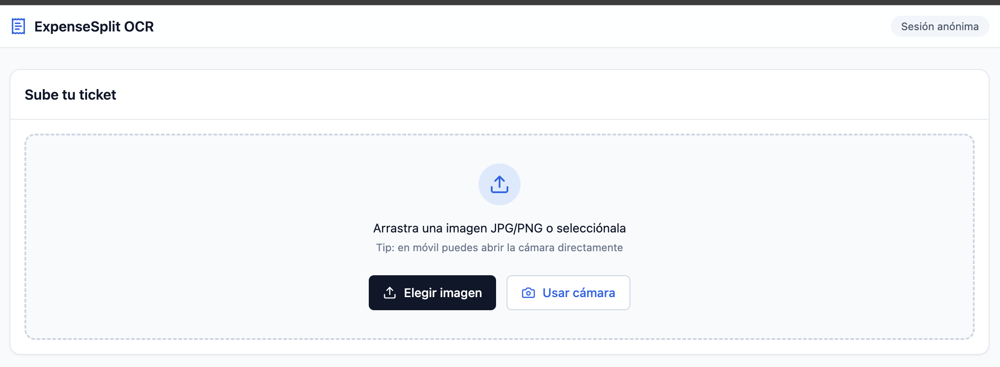

# 💸 ExpenseSplit OCR

**IA Multimodal + Clean Architecture** para la división inteligente de gastos.  
*Proyecto destacado para la **Hackatón CubePath 2026**.*

[](https://nx.dev)
[](https://nestjs.com)
[](https://nextjs.org)
[](https://deepmind.google/technologies/gemini/)

---

## 🌟 La Propuesta de Valor

**ExpenseSplit OCR** resuelve el caos de las cuentas compartidas mediante una experiencia **Zero-Login**. Sube una foto, deja que la IA procese los ítems y comparte el resumen por WhatsApp en segundos. 

**Demo en vivo:** [https://tu-app.cubepath.com](https://tu-app.cubepath.com)

### 🛠️ Stack Tecnológico de Elite
* **Monorepo:** Gestión eficiente con **Nx Build System**.
* **IA Engine:** Implementación de **Gemini 2.5 Flash** (Multimodal nativo) para una precisión de OCR superior en tickets complejos.
* **Backend:** **NestJS** siguiendo principios **SOLID** y **Clean Architecture**.
* **Frontend:** **Next.js 15** (App Router) + **Tailwind CSS** + **shadcn/ui**.
* **Infraestructura:** Despliegue en **CubePath (Dokploy)** con PostgreSQL interno y **Supabase Storage** para gestión de imágenes.

---

## 🧠 Retos Técnicos & Resiliencia

Durante el desarrollo, superamos desafíos críticos de integración:

1.  **Validación de Datos con Zod:** Implementamos **pre-processing** en los esquemas de Zod para normalizar formatos de fecha e importes, mitigando alucinaciones comunes en modelos LLM.
2.  **Storage Híbrido:** Las imágenes se procesan en memoria con **Sharp** (resize/compresión) y se almacenan temporalmente en Supabase con políticas de **RLS** configuradas para acceso anónimo seguro.

---

## 🏗️ Arquitectura del Sistema

### Estructura de Capas (Clean Architecture)

| Capa | Responsabilidad |
| :--- | :--- |
| **Domain** | Lógica pura de Split y entidades de sesión. |
| **Infrastructure** | Adaptadores para Gemini, Supabase y Persistencia. |
| **Application** | Orquestación de casos de uso (OCR -> Parse -> Store). |
| **Shared/Contracts** | Esquemas de **Zod** compartidos (Single Source of Truth). |

---

## ☁️ Uso de CubePath & Dokploy

Para este proyecto hemos aprovechado la infraestructura de **CubePath** para desplegar una solución robusta y auto-gestionada:

1. **Orquestación con Dokploy:** Utilizamos el panel de Dokploy para gestionar el despliegue automático (CI/CD) directamente desde nuestro monorepo en GitHub.
2. **Red Interna Segura:** La base de datos PostgreSQL corre en un contenedor dentro de la red privada de CubePath, sin exposición a internet, mejorando la seguridad.
3. **Escalabilidad:** Gracias a los recursos del VPS de CubePath, el procesamiento de imágenes con `sharp` y el motor de NestJS se ejecutan con baja latencia.
4. **Health Checks:** Configuramos monitoreo nativo en Dokploy para asegurar que el servicio OCR esté siempre disponible.


## 📸 Screenshots



## ✅ Estado del MVP

### ⚡ Core Engine (Backend)
- [x] **OCR Multimodal:** Extracción de JSON estructurado desde imágenes.
- [x] **Image Optimization:** Procesamiento con `sharp` para reducir consumo de tokens.
- [x] **Resilience Plan:** Sistema de reintentos y manejo de errores tipado.
- [x] **Data Privacy:** Purga automática de registros (TTL 48h).

### 🎨 Experiencia de Usuario (Frontend)
- [x] **Mobile First:** Interfaz optimizada para captura con cámara.
- [x] **Live Editing:** Formulario reactivo para corrección manual post-OCR.
- [x] **Smart Copy:** Generador de resumen para WhatsApp.
- [x] **Split Engine:** Cálculos precisos de deudas con 2 decimales.

---

## 🚀 Quick Start (Local)

### Requisitos
* Node.js 20+
* Docker
* Google Gemini API Key

### Instalación
```bash
# Instalar dependencias
npm install

# Levantar servicios con Docker
docker-compose up -d

### Variables de Entorno (.env)
GEMINI_API_KEY=tu_clave_aqui
GEMINI_MODEL=gemini-2.5-flash
SUPABASE_URL=tu_url_supabase
SUPABASE_KEY=tu_key
SUPABASE_BUCKET=ticket-images
````

Autor: [Yonnier Alemán](https://github.com/yonnije)

Hackatón: CubePath 2026 (midudev)

Licencia: MIT